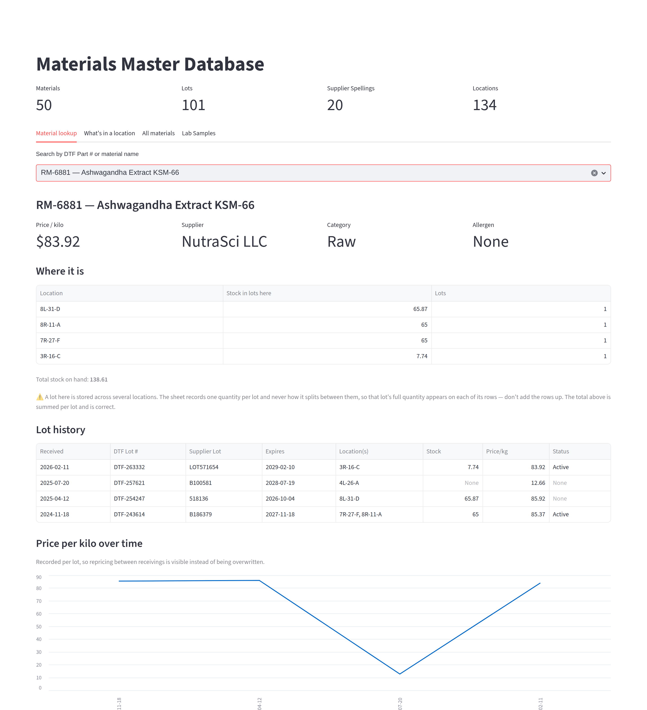

# DTF Materials Master

[](https://github.com/dislam7991/materials-master-db/actions/workflows/ci.yml)

## The problem

A supplement contract manufacturer with no ERP keeps every raw material in one
shared Google Sheet and the R&D lab's flavor samples in another. Answering "where
is this material, what did it cost, who supplies it?" means scrolling a
spreadsheet that carries the same part number on two different materials, five
spellings of the same supplier, and prices that aren't numbers. This project
reads those sheets into a queryable SQLite database with a search app on top,
and prints a report naming every dirty row it found instead of quietly papering
over it.



*Material lookup, running on the synthetic sheet in this repo — no real material
names, prices or suppliers appear anywhere in it. The warning under the location
table is the design principle in miniature: the sheet records one quantity per
lot and never how it splits across locations, so the app says so rather than
dividing the number up. See [docs/quality_report_sample.md](docs/quality_report_sample.md)
for what the data-quality report has to say about the same data.*

## What it is

A small internal data platform. It reads the company's live Google Sheets, cleans
them, and lands them in a SQLite database with a Streamlit lookup app on top. Two
separate sources feed it:

* **the warehouse raw-material inventory sheet** → `materials` / `lots` /
  `lot_locations`, the materials master proper;
* **the R&D lab's flavor sample catalog** — a second, unrelated Google Sheet on a
  different account → the `lab_samples` table and its own search tab in the app.

Alongside them, a data-quality report that names every dirty row in the inventory
source, as evidence of the mess the spreadsheet-only workflow creates.

**No real data lives in this repository.** The generator in
`scripts/generate_synthetic_sheet.py` produces a fake inventory sheet with the same
column structure and the same kinds of dirtiness as the real one, and that is what
the tests and CI run against. The connections to the real sheets live in a local,
gitignored `config.local.toml` and are never committed.

## Quickstart

Clone it and run these five lines. Nothing needs configuring: the generator
writes the fake sheet, so the pipeline has data to chew on from a cold start.

```
python dtf_materials/db.py                    # create db/materials.db from db/schema.sql
python scripts/generate_synthetic_sheet.py    # write data/synthetic/raw_material_inventory.csv
python -m dtf_materials.etl                    # stage + load the sheet into the DB
python -m dtf_materials.quality_report         # print the dirty-data findings
streamlit run app.py                           # launch the lookup app
```

Requires Python 3.11+. The pipeline is stdlib-only; `pip install -r
requirements.txt` is needed only for the last line, the app. `python -m pytest`
runs the test suite (`pip install -r requirements-dev.txt`).

Everything above runs against synthetic data. Connecting the real sheets is
[its own section below](#connecting-the-real-sheets), and needs credentials
that are not in this repository.

## Status

The full plan, with definitions of done and the reasoning behind each scope
decision, is in [SPEC.md](SPEC.md). This is the summary.

**Built and working:**

- [x] Schema + idempotent database initialization
- [x] Synthetic dirty-data generator (seeded, real column structure)
- [x] ETL: extract → stage → validate → load, atomic and idempotent
- [x] Data-quality report citing exact source rows, `--out` to Markdown
- [x] Streamlit lookup app — material lookup, location lookup, all-materials table
- [x] **Phase A — hardening.** Pytest suites for `cleaning.py` and for the three
      ETL load invariants; GitHub Actions CI running the whole pipeline plus the
      tests on every push
- [x] **Phase B — real inventory source.** Local config loader (`config.local.toml`
      + committed `config.example.toml`), `SheetsInventorySource`, and a confirmed
      first run against the live company sheet on a configured machine
- [x] **Phase E — lab sample catalog.** The second sheet mapped and documented
      ([docs/flavor_sample_sheet_layout.md](docs/flavor_sample_sheet_layout.md)),
      the `lab_samples` table and its loader, and a Lab Samples search tab in the app
- [x] Windows one-click launcher ([run_app.bat](run_app.bat)) for handing the app
      to someone who won't run commands
- [x] **D1.** README top section: problem statement, screenshot, quality-report
      sample, quickstart

**Remaining (Phase D — portfolio polish):**

- [ ] **D2.** Repo hygiene: LICENSE (MIT), `.gitattributes` for line endings, a
      short CONTRIBUTING note saying this is a personal portfolio project

**Parked — Phase C (sample-request ingestion).** Parsing the loose Excel
sample-request files into `samples` / `sample_materials`, so material usage history
exists in one place. It was goal 5 of the original plan; nobody is asking for it, so
it is parked rather than deleted — the tasks stay in SPEC.md in the right order in
case material usage history is ever actually wanted. Note this is a different thing
from Phase E: sample *requests* from clients, not the lab's catalog of vendor
flavor samples.

**Known gaps, deliberately not built yet** (the reasoning is in SPEC.md):

- No combined warehouse + lab location view. The matching strategy is decided and
  documented (Part # first, falling back to Sample Code found inside the warehouse
  material name; never fuzzy name matching), but nothing uses it yet.
- No lab-specific quality report. The loader flags duplicate sample codes on stdout;
  there is no equivalent of `quality_report.py` for the lab sheet.
- No parser for the lab's location codes (`A-2-1`-style, and plain-English ones
  alongside them), and declaration-type tags whose order varies (`Natural, WONF` vs
  `WONF, Natural`) still read as two distinct categories.

## Connecting the real sheets

To load from the real Google Sheet instead of the synthetic CSV, set up
`config.local.toml` (copy `config.example.toml` — see that file for the
shape), `pip install -r requirements-sheets.txt`, then:

```
python -m dtf_materials.etl --source sheets
```

The service account backing this must only ever be shared on the sheet as
**Viewer** — this project has no code path that writes back to it.

The R&D lab's flavor sample catalog is a second, separate Google Sheet (see
`docs/flavor_sample_sheet_layout.md`) — add a `[lab_sheet]` section to the
same `config.local.toml`, then:

```
python -m dtf_materials.lab_samples
```

Loads into its own `lab_samples` table and flags any duplicate sample codes
found. Same Viewer-only rule applies.

### Windows: one-click launch

[`run_app.bat`](run_app.bat) is a double-click launcher, meant for handing this
to someone who won't run commands. It behaves differently depending on whether
`config.local.toml` is present, because there are two very different people
running it:

| | **Operator** (has the config + service account key) | **Viewer** (a colleague) |
|---|---|---|
| Installs | app deps + `requirements-sheets.txt` | app deps only |
| Database | refreshed from both sheets on every launch | left exactly as received |
| Needs Google access | yes | **no** |

On first run it creates the virtual environment and installs dependencies;
after that it activates and launches. Every setup step is checked, and a failed
install deletes its own half-built environment so the next double-click retries
rather than skipping past it.

Requires Python 3.11+ (from python.org — check "Add python.exe to PATH" during
setup). The launcher verifies the version rather than just that some `python`
answers, which also catches the Microsoft Store's placeholder `python.exe`.
Right-click the file → **Send to → Desktop (create shortcut)** for a permanent
icon.

**As the operator**, each launch re-runs the inventory ETL and the lab-sample
loader before starting the app, so you are always looking at current data. This
is a re-run, not a rebuild — the database file is never deleted, because the
ETL is already idempotent and atomic and deleting it would discard the stable
`material_id`s it works to preserve. If a refresh fails (no network, sheet not
shared), the app still launches on the data already in the database rather than
refusing to start. To skip the refresh entirely:

```
run_app.bat --no-refresh
```

### Handing the app to a colleague

**Do not copy the service account key.** It is a credential, not a setting:
whoever holds that file can read both sheets as that identity, from any
machine, until the key is revoked. Sheet IDs alone grant nothing, so
"just paste in the IDs" doesn't work either — the key is the part that matters,
and it is the part not to distribute.

They don't need Google access at all. The app only ever reads
`db/materials.db`; `gspread` exists solely for the two loaders that *fill* it,
which is why `requirements-sheets.txt` is a separate file. So:

1. Run the app here once, so the database holds current data.
2. Send them the repo folder **plus `db/materials.db`** (~1.4 MB). It is
   gitignored, so it will not arrive via `git clone` — use a shared drive or
   send the file.
3. They double-click `run_app.bat`. Seeing no config, it installs app
   dependencies only, leaves the database untouched, and launches.

Two caveats. The database is a **snapshot**: it goes stale until you send a new
one. And it contains real material names, prices, and suppliers — fine for a
colleague who already has sheet access, but it is a data handoff, not just a
program.

A shared database on a synced drive would replace step 2 with one central
refresh. See the Backlog in [SPEC.md](SPEC.md) for why that is worth doing only
once the ETL is pointed at the company's live sheet.

## The lookup app

See [app.py](app.py) (UI only) and [dtf_materials/queries.py](dtf_materials/queries.py)
(all data access). They are separate so the queries can be tested from a REPL
or reused by a future CLI/API without importing Streamlit.

Four tabs: look up a material by Part # or name, look up what is stored at a
location (a full code like `6L-27-D`, or an aisle prefix like `6L`), browse
every material in a sortable table, and search the R&D lab's flavor sample
catalog by vendor, flavor name, sample code, or Part # — a separate table
fed by a separate sheet (see `docs/flavor_sample_sheet_layout.md`).

**Search is parameterized and wildcard-escaped.** User input never reaches SQL
as a string fragment, and `%`/`_` in a search term match literally — otherwise
searching for a material named "Whey Protein Isolate 90%" would silently match
everything. Results rank exact and prefix Part # matches first, because
someone typing a part number wants that material, not the alphabetically-first
name containing the string.

**Stock figures are reported honestly, which took three passes to get right.**
The source records one quantity per lot plus the location(s) that lot
occupies, and never how the quantity splits between them. So:

* A lot spanning several locations contributes its *full* quantity to each of
  its rows. The app flags this and tells you not to sum the rows — dividing
  the quantity evenly would be fabricating a number the company doesn't have.
* Stock in lots with a blank Locations cell appears in the total but in no
  row. The app reports that quantity explicitly rather than letting the two
  numbers disagree silently — material the company owns and cannot locate
  from the record is exactly what this tool exists to surface.
* A material with nothing in stock shows its last known location, clearly
  labelled. "No stock on hand" is not the same as "no idea where this lives".

## ETL design

See [dtf_materials/etl.py](dtf_materials/etl.py), [dtf_materials/cleaning.py](dtf_materials/cleaning.py),
and [dtf_materials/sources/](dtf_materials/sources/).

**Source is an interface, not a file format.** `InventorySource.rows()` yields
dicts keyed by the sheet's own header names. There are two implementations:
`CsvInventorySource` (the default, reading the synthetic sheet) and
`SheetsInventorySource` (the real Google Sheet, via the gitignored local
config). Adding the second one changed nothing in `etl.py`, `cleaning.py`, or
the schema — which is what the interface was for. This is the portability
requirement, and it has now been paid off rather than merely promised: swap
the source, not the pipeline.

`gspread`/`google-auth` are imported only inside the `--source sheets` branch,
so the default pipeline, the app, and CI never need them and the core ETL
stays stdlib-only.

**Real header rows have cosmetic whitespace; the reader normalizes it.** The
live sheet's header row turned out to spell the same columns differently from
the synthetic one — `Lot / Batch` vs `Lot/Batch`, `Category (1 Raw) (2 Flavor)`
vs `Category (1 Raw)(2 Flavor)`, trailing spaces. `normalize_header_name` in
[dtf_materials/sources/base.py](dtf_materials/sources/base.py) collapses
whitespace *around punctuation only*, never inside the words, so it cannot make
two genuinely different columns collide. A column that is actually missing
after normalization is still a hard error: rows are matched by header name, not
position, so a silently-renamed column would otherwise load as all-blanks.

**Two-pass load: stage first, always.** Every source row lands in
`staging_inventory_raw` as untyped text before any cleaning happens. Cleaning
functions (`dtf_materials/cleaning.py`) are pure — a raw string in, a clean
value or `None` out, never an exception — so a single bad cell can't crash a
106-row load. The data-quality report queries staging directly, so it can
point at a broken cell even on a row that never made it into `materials`/`lots`.

**Full reload of lots, upsert of materials.** Each run truncates staging,
`lots`, and `lot_locations` and rebuilds them from the source; `materials`
and `suppliers` are upserted on their business keys and never deleted. The
distinction matters: `material_id` is a stable identity that
`sample_materials` references, so delete-and-reinsert would reassign every id
on each run and merely re-sorting the source sheet would silently repoint
sample history at the wrong materials. Lots can be rebuilt freely because
nothing outside `lot_locations` references `lot_id`. Consequence: a material
that disappears from the sheet stays in the database (correct for a master
table — it keeps history) and is counted as `stale_materials` in the run stats.

**The load is one atomic transaction.** The run starts by clearing lots and
staging, so a failure partway through — a malformed row, or a dropped
connection mid-fetch once the source is the live Google Sheet — would
otherwise leave the database emptied and not repopulated. Everything between
reset and price-refresh commits together or rolls back entirely.

For a sheet this size (hundreds of rows, run on demand) reloading beats
tracking "what's new since last run," and it makes every run idempotent. The
natural next step, once volume justifies it, is incremental loads keyed on
Receiving Date + DTF Lot #; that's a deliberate scope cut, not an oversight.

**Conflicting Part # handling.** When the same DTF Part # appears with two
different material names, the first-seen row wins as the canonical
`materials` row (Part # is the identity that matters), and every later
conflicting row still gets its lot attached to that material — but the
conflict is counted and the quality report names the exact source rows. The
ETL never silently guesses which name is "right"; a human resolves it.

**Supplier normalization is two-tiered.** Spellings that differ only by case
or whitespace ("Sensapure Flavors" vs "sensapure flavors") are auto-merged
via a normalized key, since that's unambiguous. Spellings that are genuinely
different strings ("NutraSci" vs "Nutra Sci") are *not* auto-merged — merging
fuzzy string matches automatically is how you silently combine two different
companies. Instead the quality report flags likely duplicates (via
`difflib` similarity) for a human to review and alias together.

**Data-quality report output**, run against the synthetic data, reproducibly
finds every kind of dirtiness injected by the generator: rows with no Part #,
Part #s reused across conflicting material names, supplier spellings that
look like the same company, and unparseable/blank prices and dates — each
finding cites the exact source row number.
[docs/quality_report_sample.md](docs/quality_report_sample.md) is one such
run, written by `python -m dtf_materials.quality_report --out PATH`, which
saves the same findings the command prints as a Markdown file you can link
or hand to someone who will never run a Python command.

## The lab sample catalog

See [dtf_materials/lab_samples.py](dtf_materials/lab_samples.py) and
[docs/flavor_sample_sheet_layout.md](docs/flavor_sample_sheet_layout.md).

A second Google Sheet, on a personal account rather than the company one,
listing the flavor samples physically sitting in the R&D lab. It is a separate
source with a separate loader feeding a separate table, and the app searches it
in its own tab — deliberately independent of the warehouse inventory, because
the two answer different questions and most lab samples have no DTF Part # at
all.

**One service account, two sheets.** A service account is an identity and
sharing is per file, so the same key reads both sheets once each is shared with
its email as **Viewer**. The config grows a `[lab_sheet]` section rather than a
second credential, and that section's key path falls back to `[sheets]` when
omitted.

**Mapping the sheet came before loading it.** The first export was not a table:
the header sat on row 3 under a title banner, and an unrelated two-column
"Taste and Aroma Lexicon" was parked in columns X–Y sharing row numbers with
the first 13 real records, so any reader taking whole rows would have stapled
reference prose onto inventory. Both were fixed in the sheet itself rather than
worked around in code — cleaning up a source you control beats teaching the
parser to tolerate it. The structural findings, column fill rates, and the
decisions that came out of them are written down in the layout doc.

**Two identifier questions, kept separate.** What identifies a row *within*
`lab_samples` is a surrogate id, because Sample Code collides; how a lab sample
*links to* a warehouse material is Part # first, falling back to Sample Code
appearing inside the warehouse material name. Never fuzzy name matching — two
vendors' "Vanilla" must not be silently merged. The link is designed but the
combined location view that would use it isn't built yet.

## Schema design

See [db/schema.sql](db/schema.sql). The core decisions, and why:

**Surrogate key on materials, not DTF Part #.** DTF Part # is the business key and
is enforced `UNIQUE`, but it is nullable: new vendor sample materials exist (with a
vendor code, decoded off the bottle) before the company ever assigns them a Part #
or holds stock. Keying on an internal `material_id` means a sample material becomes
a stocked material by filling in one column — no row migration, and any sample
history already attached to it survives. A `CHECK` guarantees every material has at
least one identifier (Part # or vendor code).

**Lots are a separate one-to-many table.** One material is received many times.
Everything that changes per receiving — DTF Lot #, supplier lot/batch, receiving and
expiration dates, stock levels, location, price — lives on `lots`. The material row
holds only what is true of the material itself (name, supplier, category, allergen).

**Price lives on the lot; the material carries a derived current price.** Suppliers
reprice between receivings, so `price_per_kilo` is recorded per lot, which gives
price history for free. For convenient lookups, the ETL refreshes
`materials.current_price_per_kilo` from the most recent lot.

**Locations: raw text preserved, parsed rows beside it.** A location is a
hyphen-joined alphanumeric code (`6L-27-D`), and one cell can hold several,
usually comma-separated (`6R-09-E, 6R-10-C, 6R-13-C`). Some locations are
named words instead (`cooler`), and the cell can be blank. The lot keeps the
verbatim cell (`locations_raw`) so nothing is lost; `lot_locations` holds the
parsed, upper-cased individual codes, which is what makes "what else is in
rack 6L?" a simple query.

Splitting on whitespace is conditional on purpose: `6R-09-E 6R-10-C` is two
locations, but `back cooler` is one. A token is only split on whitespace when
every resulting piece matches the code pattern; otherwise it is kept intact
as free text rather than guessed at. The quality report then flags parsed
locations that match neither the code format nor a known named location —
and because it counts repeats, a value appearing many times reads as a real
named location to whitelist, while a one-off (`1L-28-`) reads as a typo.

**Suppliers normalized with an alias table.** The sheet spells the same supplier
several ways. `suppliers` holds one canonical row per company;
`supplier_aliases` maps each raw spelling to it. The ETL resolves spellings through
the alias table and flags unmapped ones.

**A raw staging table.** `staging_inventory_raw` mirrors the source sheet, all
columns as text, one row per sheet row. The ETL lands data there first, then
transforms into the typed tables. This means the data-quality report can point at
exact source rows — including rows too broken to load at all.

**SQLite, dates as ISO-8601 text.** SQLite because this is a single-writer internal
tool with no server to administer; the schema is plain SQL and ports to Postgres
nearly verbatim if it ever needs concurrent writers. SQLite has no date type, so
dates are stored as `yyyy-mm-dd` text, which sorts and compares correctly.

**Category mirrors the source (`raw`/`flavor`) with a CHECK constraint.** The sheet
only knows two categories; the database stays honest to that rather than inventing
data. Finer categories (colorant, masking agent) can come later as a lookup table.

**`lab_samples` is flat, and not a foreign key into `materials`.** The lab
catalog gets one table, not the staging + typed pair that `materials`/`lots`
uses, because there is no one-to-many relationship to model — each source row
already *is* one physical sample sitting on a lab shelf. It keeps `source_row`
for the same reason staging does: so a future lab quality report can cite exact
sheet rows. `dtf_part_num` is nullable and deliberately *not* a foreign key —
most lab samples don't have a Part # yet (they are samples-in-waiting, not yet
adopted into inventory), and even once one is filled in, linking a sample to a
warehouse material is a display-time join, not a constraint this table should
enforce. `lab_sample_id` is a surrogate key because Sample Code is not unique in
the real sheet: it collided 22 ways in the first export, and the loader flags
those rather than silently picking a winner.
