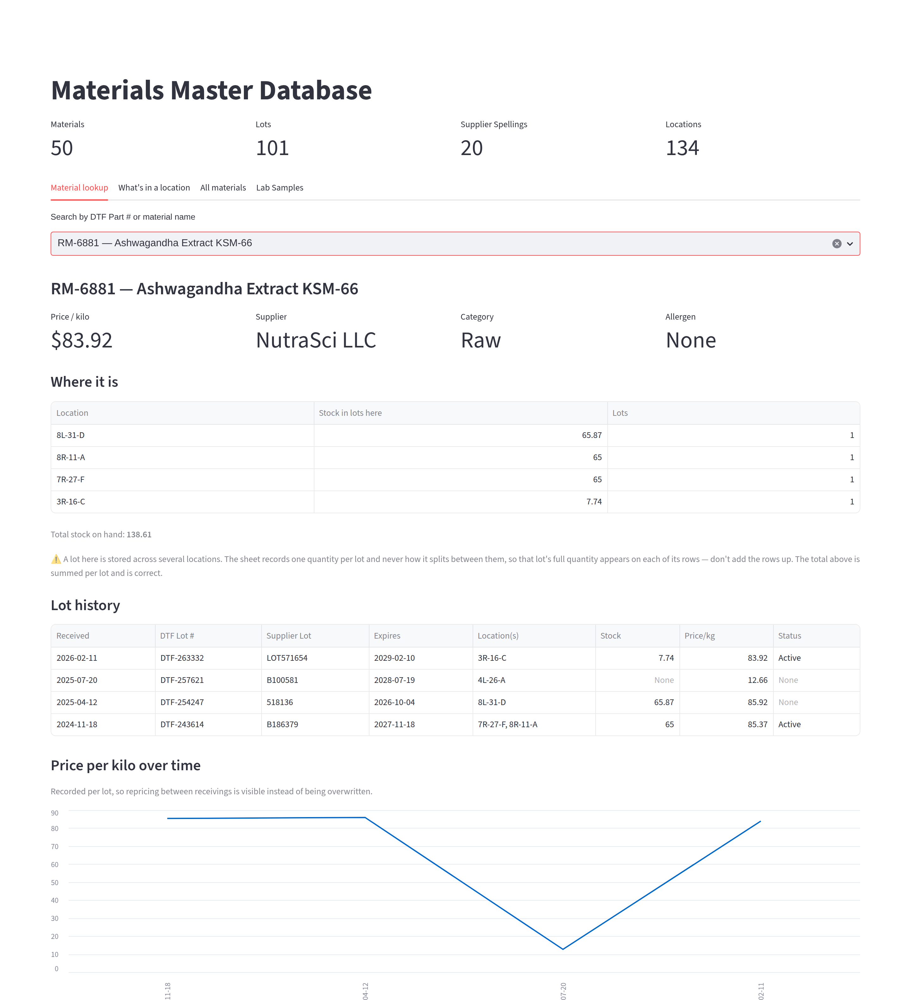

# DTF Materials Master

[](https://github.com/dislam7991/materials-master-db/actions/workflows/ci.yml)

## The problem

A supplement contract manufacturer with no ERP keeps every raw material in one
shared Google Sheet, and the R&D lab's flavor samples in another. Answering
"where is this material, what did it cost, who supplies it?" means scrolling a
spreadsheet that carries the same part number on two different materials, five
spellings of one supplier, and prices that aren't numbers.

This reads both sheets into a queryable SQLite database with a search app on
top, and reports every dirty row instead of papering over it. On top of that
data, it cuts the transcription out of documenting a finished sample: the
company Flavor Sheet filled from the database, and the flavor lines of the
Sample Record Sheet handed over ready to paste.



*Running on the synthetic sheet in this repo — no real names, prices or
suppliers. The warning under the location table is the principle in miniature:
the sheet records one quantity per lot, never how it splits across locations,
so the app says so rather than dividing the number up.*

## What it is

A small internal data platform. Two sources feed it:

* **the warehouse inventory sheet** → `materials` / `lots` / `lot_locations`,
  the materials master proper;
* **the R&D lab's flavor sample catalog**, a second sheet on a different
  account → the `lab_samples` table and its own search tab.

Plus a data-quality report identifying every dirty row in the inventory
source, and **sample documentation** built from both catalogs — the one part of
the database authored in the app rather than loaded from a sheet.

**No real data lives in this repository.** `scripts/generate_synthetic_sheet.py`
writes a fake sheet with the same columns and the same dirtiness as the real
one, and that's what tests and CI run against. Real connections live in a
gitignored `config.local.toml`.

## Quickstart

Five lines, nothing to configure — the generator writes the fake sheet, so
there's data from a cold start.

```
python dtf_materials/db.py                    # create db/materials.db from db/schema.sql
python scripts/generate_synthetic_sheet.py    # write data/synthetic/raw_material_inventory.csv
python -m dtf_materials.etl                    # stage + load the sheet into the DB
python -m dtf_materials.quality_report         # print the dirty-data findings
streamlit run app.py                           # launch the lookup app
```

Python 3.11+. The pipeline is stdlib-only; `requirements.txt` is needed only
for the app. `python -m pytest` runs the tests (`requirements-dev.txt`).

Everything runs on the synthetic data except the Flavor Sheet's **Download**
button, which fills the company's own template. That file carries branding, so
it isn't committed: copy it to `data/real/templates/Flavor Sheet Blank
Template.xlsx` (gitignored) to enable downloads. The tests build a synthetic
template of the same shape instead.

Connecting the real sheets needs credentials that aren't in this repo —
[see below](#connecting-the-real-sheets).

## Status

Full plan, definitions of done and scope reasoning in [SPEC.md](SPEC.md).

**Built:** schema and idempotent DB init; seeded dirty-data generator; the ETL
(extract → stage → validate → load, atomic and idempotent); the quality report
with `--out` to Markdown; the Streamlit app; the live Sheets source, confirmed
against the real company sheet; the lab sample catalog (sheet mapped, table,
loader upserting on a stable RD-ID, search tab); the combined Warehouse + Lab
tab, one search across both catalogs; a Windows one-click launcher; pytest
across the pipeline, loaders, queries and Phase F renderers, plus an app smoke
test, with CI on every push.

**Phase F — sample documentation (active).** Built: the three company
templates mapped ([layout doc](docs/phase_f_templates_layout.md)); the Flavor
Sheet tab — build, save, reopen and download the filled template; the Sample
Record Sheet copy block. Remaining: **labels** (F4, filling the `.docx` label
template) and a **snapshot at download** (F2h), so a reprint after a reprice
can be told apart from the copy already sent. Building the whole record sheet
in the app (F2c2, F2d–F2g) is parked — the copy block saves most of the
typing first.

**Gated — Phase G (online and multi-user).** Written down so the shape is
agreed in advance, not queued: every step spends money, moves company data off
the machine, or changes who sees prices.

**Parked — Phase C (sample-request ingestion).** Parsing the loose Excel
sample-request files into `samples` / `sample_materials`. Goal 5 of the
original plan; nobody is asking for it, so the tasks stay in SPEC.md in order
rather than being deleted. Not the same as Phase E: sample *requests* from
clients, not the lab's catalog of vendor samples.

**Known gaps, deliberately not built** (reasoning in SPEC.md):

- No lab quality report. The loader flags duplicate sample codes on stdout.
- No parser for the lab's location codes (`A-2-1`-style, plus plain-English
  ones), and declaration tags whose order varies (`Natural, WONF` vs
  `WONF, Natural`) still read as two categories.

## Connecting the real sheets

Copy `config.example.toml` to `config.local.toml`, fill it in, then
`pip install -r requirements-sheets.txt`:

```
python -m dtf_materials.etl --source sheets
```

The service account must only ever be shared as **Viewer** — nothing here
writes back.

The lab catalog is a second sheet ([layout
doc](docs/flavor_sample_sheet_layout.md)); add a `[lab_sheet]` section to the
same config, then `python -m dtf_materials.lab_samples`. Upserts into
`lab_samples` on RD-ID, skips and lists rows whose RD-ID is missing, malformed
or shared, flags duplicate sample codes; same Viewer-only rule.

### Windows: one-click launch

[`run_app.bat`](run_app.bat) is for handing this to someone who won't run
commands. It behaves differently depending on whether `config.local.toml` is
present, because two different people run it:

| | **Operator** (has config + key) | **Viewer** (a colleague) |
|---|---|---|
| Installs | app deps + `requirements-sheets.txt` | app deps only |
| Database | refreshed from both sheets each launch | left as received |
| Needs Google access | yes | **no** |

First run creates the virtualenv and installs; after that it activates and
launches. A failed install deletes its own half-built environment, so the next
double-click retries rather than skipping past it.

Python 3.11+ from python.org — tick "Add python.exe to PATH". The launcher
checks the version rather than that some `python` answers, which catches the
Microsoft Store's placeholder `python.exe`.

**As the operator**, each launch re-runs both loaders first. A re-run, not a
rebuild: the database is never deleted, because the ETL is idempotent and
deleting it would discard the stable `material_id`s — and every flavor sheet
built in the app, which no loader can recreate. Back `db/materials.db` up. If a refresh fails (no
network, sheet not shared), the app still launches on existing data. Skip with
`run_app.bat --no-refresh`.

### Handing the app to a colleague

**Do not copy the service account key.** It's a credential, not a setting:
whoever holds it can read both sheets as that identity, from any machine, until
it's revoked. Sheet IDs alone grant nothing, so "just paste in the IDs" doesn't
work either.

They don't need Google access — the app only reads `db/materials.db`, and
`gspread` exists only for the loaders that *fill* it, hence the separate
`requirements-sheets.txt`. So:

1. Run the app here once, so the database is current.
2. Send them the repo folder **plus `db/materials.db`** (~1.4 MB). It's
   gitignored, so it won't arrive via `git clone`.
3. They double-click `run_app.bat`. Seeing no config, it installs app deps
   only, leaves the database alone, and launches.

Three caveats: the database is a **snapshot** and goes stale until you send a
new one; it holds real names, prices and suppliers — fine for a colleague who
already has sheet access, but it's a data handoff, not just a program; and it
holds your flavor sheets too, so a fresh copy overwrites any the colleague
built on theirs.

A shared database on a synced drive would replace step 2 with one central
refresh. The SPEC.md Backlog has why that waits until the ETL points at the
live sheet.

## The lookup app

[app.py](app.py) lays out the page and [ui/](ui/) holds one module per tab;
[queries.py](dtf_materials/queries.py) is all data access — separate so the
queries can be tested from a REPL or reused by a future CLI without importing
Streamlit.

Seven tabs: one search across both catalogs, saying whether something is in the
warehouse, the lab, or both; a material by Part # or name; what's at a location
(a full code like `6L-27-D`, or an aisle prefix like `6L`); everything in a
sortable table; the lab's samples by vendor, flavor name, sample code or Part #;
and the two [sample documentation](#sample-documentation) tabs, Flavor Sheet
and Sample Record Sheet.

**The combined tab is the way in, not a replacement.** It summarizes whichever
sides exist and names the tab holding the rest, because the two single-source
tabs answer different questions in depth and neither can answer "warehouse, lab
or both?" from a cold start — a lab-only sample has no material row, so
searching the warehouse for it finds nothing and explains nothing. A lab sample
links to a material by Part #, or by its sample code appearing in the material's
name (the real pattern: "Mango 7182011"), with a four-character floor on that
fallback and every match shown rather than one picked. Never by name similarity:
two vendors' "Vanilla" are two materials.

**Search is parameterized and wildcard-escaped.** Input never reaches SQL as a
string fragment, and `%`/`_` match literally — otherwise searching for "Whey
Protein Isolate 90%" would match everything. Exact and prefix Part # matches
rank first: someone typing a part number wants that material, not the
alphabetically-first name containing the string.

**Stock figures are reported honestly**, which took three passes to get right.
The source records one quantity per lot plus the location(s) it occupies, never
how the quantity splits between them. So:

* A lot spanning several locations contributes its *full* quantity to each row.
  The app flags this and says not to sum them — dividing evenly would fabricate
  a number the company doesn't have.
* Stock in lots with a blank Locations cell appears in the total but in no row.
  The app reports that quantity explicitly rather than letting two numbers
  disagree silently. Material the company owns and cannot locate is exactly
  what this tool exists to surface.
* A material with nothing in stock shows its last known location, labelled.
  "No stock on hand" is not "no idea where this lives".

## ETL design

See [etl.py](dtf_materials/etl.py), [cleaning.py](dtf_materials/cleaning.py),
[sources/](dtf_materials/sources/).

**Source is an interface, not a file format.** `InventorySource.rows()` yields
dicts keyed by the sheet's own header names. `CsvInventorySource` reads the
synthetic sheet, `SheetsInventorySource` the real one. Adding the second
changed nothing in `etl.py`, `cleaning.py` or the schema — swap the source, not
the pipeline. `gspread`/`google-auth` import only inside the `--source sheets`
branch, so the default pipeline, the app and CI never need them.

**Real header rows have cosmetic whitespace; the reader normalizes it.** The
live sheet spelled the same columns differently — `Lot / Batch` vs `Lot/Batch`,
trailing spaces. `normalize_header_name` collapses whitespace *around
punctuation only*, never inside words, so two genuinely different columns can't
collide. A column still missing after normalization is a hard error: rows match
by header name, not position, so a silently-renamed column would load as
all-blanks.

**Two-pass load: stage first, always.** Every row lands in
`staging_inventory_raw` as untyped text before any cleaning. Cleaning functions
are pure — raw string in, clean value or `None` out, never an exception — so one
bad cell can't crash a 106-row load. The quality report queries staging
directly, so it can point at a broken cell on a row that never reached
`materials`/`lots`.

**Full reload of lots, upsert of materials.** Each run truncates staging,
`lots` and `lot_locations` and rebuilds them; `materials` and `suppliers` are
upserted on their business keys and never deleted. `material_id` is a stable
identity that `sample_materials` references, so delete-and-reinsert would
reassign every id each run, and merely re-sorting the source sheet would
silently repoint sample history at the wrong materials. Lots rebuild freely
because nothing outside `lot_locations` references `lot_id`. Consequence: a
material that disappears from the sheet stays in the database — correct for a
master table — and is counted as `stale_materials`.

**The load is one atomic transaction.** The run starts by clearing lots and
staging, so a failure partway through — a malformed row, a dropped connection
mid-fetch against the live sheet — would otherwise leave the database emptied
and not repopulated. Everything between reset and price-refresh commits
together or rolls back entirely.

At this size (hundreds of rows, on demand) reloading beats tracking what's new,
and every run is idempotent. The next step once volume justifies it is
incremental loads keyed on Receiving Date + DTF Lot # — a scope cut, not an
oversight.

**Conflicting Part # handling.** When one Part # appears with two material
names, the first-seen row wins as canonical (Part # is the identity that
matters) and later conflicting rows still get their lots attached — but the
conflict is counted and the report names the exact source rows. The ETL never
guesses which name is right; a human resolves it.

**Supplier normalization is two-tiered.** Spellings differing only by case or
whitespace ("Sensapure Flavors" vs "sensapure flavors") auto-merge via a
normalized key, since that's unambiguous. Genuinely different strings
("NutraSci" vs "Nutra Sci") don't — auto-merging fuzzy matches is how you
silently combine two companies. The report flags likely duplicates via
`difflib` for a human to alias together.

**The quality report** reproducibly finds every kind of dirtiness the generator
injects: missing Part #s, Part #s reused across conflicting names, supplier
spellings that look like one company, unparseable and blank prices and dates —
each citing the exact source row.
[docs/quality_report_sample.md](docs/quality_report_sample.md) is one such run,
written by `--out PATH` for handing to someone who'll never run a Python
command.

## The lab sample catalog

See [lab_samples.py](dtf_materials/lab_samples.py) and the [layout
doc](docs/flavor_sample_sheet_layout.md).

A second sheet, on a personal account rather than the company one, listing the
flavor samples physically sitting in the R&D lab. Separate source, loader,
table and tab — deliberately independent of warehouse inventory, because the
two answer different questions and most lab samples have no Part # at all.

**One service account, two sheets.** A service account is an identity and
sharing is per file, so one key reads both sheets once each is shared with its
email as Viewer. The config grows a `[lab_sheet]` section rather than a second
credential, and that section's key path falls back to `[sheets]`.

**Mapping the sheet came before loading it.** The first export wasn't a table:
the header sat on row 3 under a title banner, and an unrelated "Taste and Aroma
Lexicon" was parked in columns X–Y sharing row numbers with the first 13 real
records, so any reader taking whole rows would have stapled reference prose
onto inventory. Both were fixed in the sheet itself rather than worked around
in code — cleaning up a source you control beats teaching the parser to
tolerate it.

**Two identifier questions, kept separate.** What identifies a row *within*
`lab_samples` is the RD-ID (`RD-0000`..`RD-9999`), a column the lab maintains
in its own sheet — not Sample Code, which collides, and not the Part #, which
the company owns and most samples lack. How a lab sample *links to* a
warehouse material is Part # first, falling back to Sample Code appearing
inside the warehouse material name; the Warehouse + Lab tab applies it at read
time. Never fuzzy name matching — two vendors' "Vanilla" must not be silently
merged.

**Upsert on RD-ID, not full reload.** The loader started as a full reload like
the lots, until flavor sheets needed to reference lab samples: a surrogate id
reassigned every run would repoint those lines at the wrong sample. Now a row
keeps its id across runs, a sample dropped from the sheet stays in the
database (a flavor line may still use it), and a row with a missing, malformed
or shared RD-ID is skipped and listed rather than given an invented id.

## Sample documentation

See [flavor_sheets.py](dtf_materials/flavor_sheets.py),
[flavor_sheet_xlsx.py](dtf_materials/flavor_sheet_xlsx.py),
[record_copy_block.py](dtf_materials/record_copy_block.py) and the [template
layout doc](docs/phase_f_templates_layout.md).

Finishing a sample means filling company Excel templates by hand with values
this database already holds. Both tabs were designed backwards from the
document R&D actually fills, after a generic formula builder was tried and
didn't match the daily work.

**The Flavor Sheet** is a header (customer, product, quote ID, servings per
flavor) plus any number of flavor profiles, each a BASE amount and material
lines in mg per serving. Grams per sample are derived, never stored. Lines are
picked from the warehouse or lab catalog, or typed and marked "not in catalog"
— the one place a material can be typed, allowed because the printed sheet
carries no price, so a typed name can't fabricate a cost. Sheets save and
reopen; the open sheet lives in the page URL, so a reload doesn't lose it. The
tab shows catalog prices and a rough cost estimate from priced lines only,
labelled as such.

**Download fills the template, never regenerates it.** The renderer copies the
company file and writes inputs into known cells, keeping every style; the gram
column gets the template's own formula so Excel does the arithmetic. A flavor
longer than its slot grows the block, and every four flavors past the first
go on a copy of the template page.

**The Sample Record Sheet is a copy block, not a file.** The manager builds
that sheet in Excel from the OneDrive template and pastes the actives from the
PL Cost Sheet; the flavor lines are the part worth saving typing on. The tab
turns a flavor profile into tab-separated rows for columns A:I, and the user
pastes them below the last excipient. The app never opens the manager's file:
openpyxl alters a workbook it saves and can't grow the section safely, while
Excel does both when the user inserts rows. Part # and price resolve from the
catalog at build time; a missing price stays an empty field and is flagged —
a written 0 would hide it. Part numbers with leading zeros are written so
Excel keeps them as text, and a tab or newline inside a name can't shift the
columns.

**This is the first data no loader can rebuild.** Lines reference catalog rows
(`material_id`, `rd_id`) rather than copying names or prices, so a correction
reaches every sheet; both loaders are tested never to touch these tables. The
consequence is that `db/materials.db` stops being a disposable cache — back it
up.

## Schema design

See [db/schema.sql](db/schema.sql).

**Surrogate key on materials, not DTF Part #.** Part # is the business key and
is `UNIQUE`, but nullable: new vendor sample materials exist (with a vendor code
decoded off the bottle) before the company assigns a Part # or holds stock.
Keying on an internal `material_id` means such a material becomes a stocked one
by filling in a column — no row migration, and any sample history attached
survives. A `CHECK` guarantees at least one identifier.

**Lots are a separate one-to-many table.** One material is received many times.
Everything that changes per receiving — lot #, dates, stock, location, price —
lives on `lots`; the material row holds only what's true of the material.

**Price lives on the lot; the material carries a derived current price.**
Suppliers reprice between receivings, so `price_per_kilo` is per lot, giving
price history for free. The ETL refreshes `materials.current_price_per_kilo`
from the most recent lot for convenient lookups.

**Locations: raw text preserved, parsed rows beside it.** A location is a
hyphen-joined code (`6L-27-D`), one cell can hold several (`6R-09-E, 6R-10-C`),
some are named words (`cooler`), and the cell can be blank. The lot keeps the
verbatim cell (`locations_raw`) so nothing is lost; `lot_locations` holds the
parsed codes, which makes "what else is in rack 6L?" a simple query.

Splitting on whitespace is conditional on purpose: `6R-09-E 6R-10-C` is two
locations, `back cooler` is one. A token splits only when every piece matches
the code pattern; otherwise it's kept intact rather than guessed at. The report
flags parsed locations matching neither the code format nor a known named
location — and because it counts repeats, a value appearing many times reads as
a real named location to whitelist, a one-off (`1L-28-`) as a typo.

**Suppliers normalized with an alias table.** `suppliers` holds one canonical
row per company; `supplier_aliases` maps each raw spelling to it. The ETL
resolves through the alias table and flags unmapped spellings.

**A raw staging table.** `staging_inventory_raw` mirrors the sheet, all columns
text, one row per sheet row. This is what lets the quality report cite exact
source rows, including rows too broken to load.

**SQLite, dates as ISO-8601 text.** SQLite because this is a single-writer
internal tool with no server to administer; the schema is plain SQL and ports
to Postgres nearly verbatim if it ever needs concurrent writers. SQLite has no
date type, so dates are `yyyy-mm-dd` text, which sorts and compares correctly.

**Category mirrors the source (`raw`/`flavor`) with a CHECK.** The sheet knows
two categories; the database stays honest to that rather than inventing data.
Finer categories can come later as a lookup table.

**`lab_samples` is flat, and not a foreign key into `materials`.** One table,
not the staging + typed pair, because there's no one-to-many to model — each
source row already *is* one physical sample on a shelf. It keeps `source_row`
so a future lab quality report can cite exact sheet rows. `dtf_part_num` is
nullable and deliberately not a foreign key: most lab samples have no Part #
yet, and even once one is filled in, linking a sample to a warehouse material
is a display-time join, not a constraint this table should enforce. Identity
is `rd_id` (`UNIQUE`), because Sample Code isn't unique — it collided 22 ways
in the first export, and the loader flags those rather than picking a winner.

**Flavor sheets: three tables, one source per line.** `flavor_sheets` →
`flavor_profiles` → `flavor_profile_lines`, cascading on delete. A `CHECK`
requires each line to name exactly one of `material_id`, `rd_id` or
`typed_name` — two sources, or none, is a malformed line. `formulas` /
`formula_lines` are the earlier formula object the Flavor Sheet replaced;
they stay until the record sheet settles whether it needs them.

## License

MIT — see [LICENSE](LICENSE). It's a portfolio project rather than a library;
[CONTRIBUTING.md](CONTRIBUTING.md) says what that means for issues and pull
requests.
